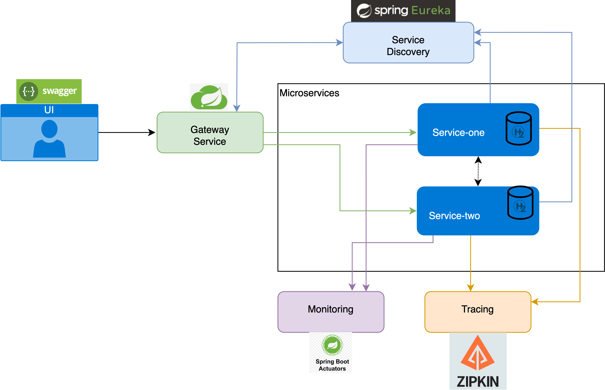

# Microservice Paraktikum Tutorial -Winter 2024/25 (TUB)- Sample service called: Micorservice-Two

This is a sample microservice demonstrating how to create a simple microservice using the Spring Boot framework. This service provides a main RESTful endpoint that returns a list of cities for a given country. It is called by Microservice One to generate a response containing the list of cities for a specific country.

## Project Technology Stack:

- **Java 17 (+)**
- [**Spring boot**](https://spring.io/projects/spring-boot) : framework
- [**Maven**](https://maven.apache.org/): build automation tool 
- [**H2**](https://www.h2database.com/html/main.html): embedded database
- [**Zipkin**](https://zipkin.io/pages/quickstart.html): tracing tool 
- [**Swagger**](https://swagger.io/tools/swagger-ui/): api document tool
- [**Eureka**](https://cloud.spring.io/spring-cloud-netflix/reference/html/): service discovery
- [**Spring cloud gateway**](https://spring.io/projects/spring-cloud-gateway): gateway

## Archirecture

## Running

For starting the program, open the project inside your IDE, go to the **src/main/java/MicroserviceTwoApplication.java** and run the class.

### usefull links after running the programm:

- http://localhost:8084/cities/healthCheck (health check service)
- spring.application.name= countries-service
- http://localhost:8084/h2-console
- http://localhost:8084/swagger-ui/index.html (SWAGGER UI FOR CLIENT CALLS)
- http://localhost:8084/actuator (SPRING ACTUATOR)
- http://localhost:8761/ (Eureka server)
- http://localhost:8084/api-docs (SWAGGER API DOCUMENT)
  

